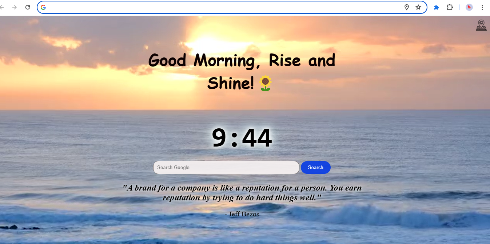
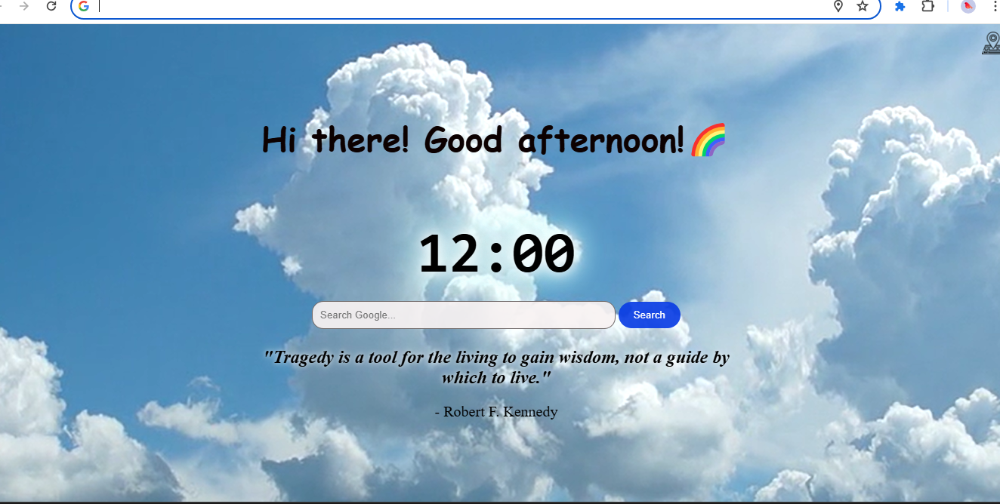
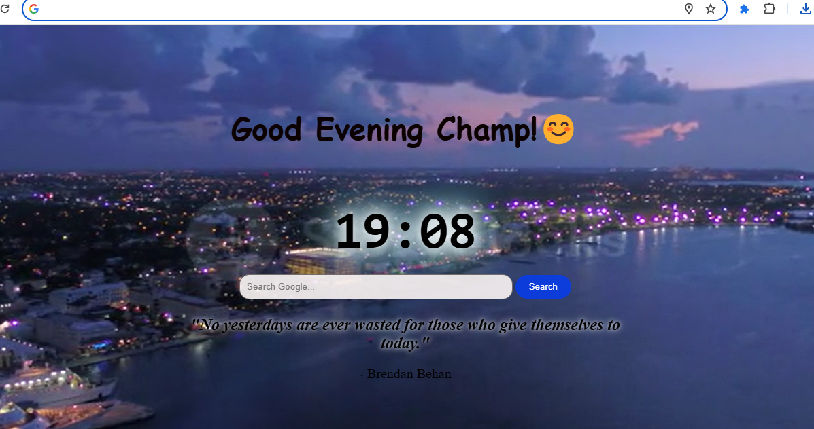

# Quote and Greeting Chrome Extension 🌟

## Overview 👁️‍🗨️
The Quote and Greeting Chrome Extension is designed to enhance your browsing experience by providing you with a new inspirational or humorous quote every time you open a new tab. Additionally, it dynamically updates the background video based on the time of day, giving you soothing nature vibes. The extension also displays the current time, ensuring you stay informed while browsing. You can also search Google directly from the new tab page, making it a versatile tool for your daily browsing needs.

## Features 🚀

### 1. Inspirational or Humorous Quotes 💬
- Each time you open a new tab, the extension displays a new inspirational or humorous quote, providing you with a fresh dose of motivation or laughter.

### 2. Dynamic Background Videos with Images 🎥
- The background dynamically changes based on the time of day, providing a soothing ambiance. Here are images for morning, afternoon, and evening:

#### Morning Background 🌅

#### Afternoon Background ☀️

#### Evening Background 🌆

### 3. Current Time Display 🕒
- Stay informed while browsing with the display of the current time, ensuring you're always on track.

### 4. Google Search Integration 🔍
- Easily search Google directly from the new tab page, streamlining your browsing experience and saving you time.

### 5. Lightweight and Fast Performance 💨
- The extension is designed to be lightweight and offer fast performance, ensuring a smooth browsing experience without any lag.

## Installation 🛠️
To install the Quote and Greeting Chrome Extension, follow these steps:

1. Clone or download this repository to your local machine.
2. Open Google Chrome browser.
3. Go to chrome://extensions/.
4. Enable "Developer mode" in the top right corner.
5. Click on "Load unpacked" and select the directory where you cloned/downloaded the extension.

## Usage 🖥️
Once the extension is installed, follow these steps to use it:

1. Open a new tab in your Chrome browser.
2. You'll be greeted with a new inspirational or humorous quote, along with the current time, all displayed against a soothing background video.
3. To search Google, simply enter your query in the search box provided on the new tab page and press Enter.

## Support 🤝
For any questions, issues, or feature requests, feel free to reach out to me. You can submit an issue on [GitHub](https://github.com/AASTHA2020/Greetings_Extensions/issues), and I'll be happy to assist you.

